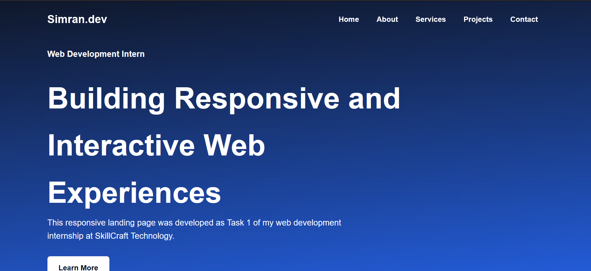
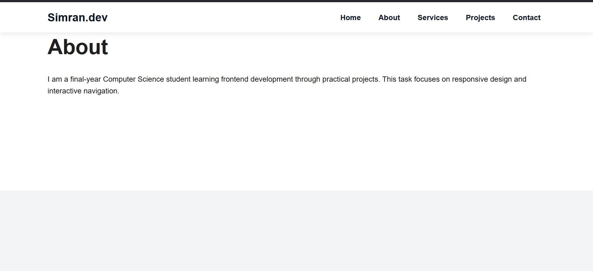
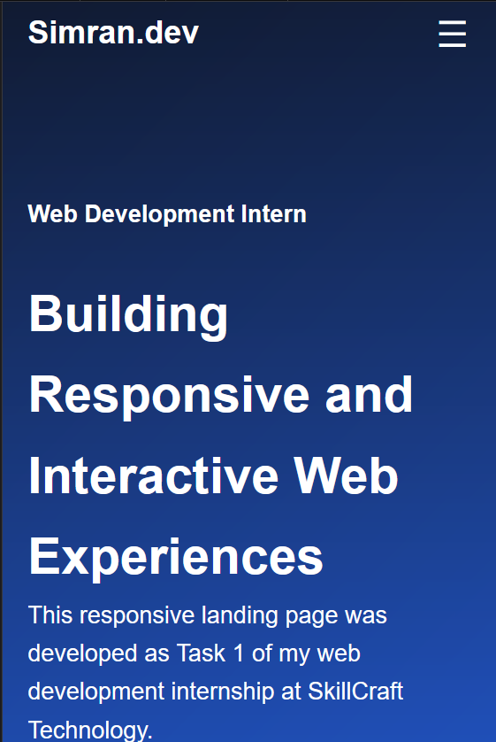

# Task 01: Responsive Landing Page

## Description

This project is a responsive landing page developed as part of my web development internship at SkillCraft Technology.

## Features

- Fixed navigation bar
- Navigation hover effects
- Scroll-based navigation styling
- Responsive mobile menu
- Smooth scrolling
- Mobile, tablet and desktop support
- Multiple landing page sections

## Technologies Used

- HTML5
- CSS3
- JavaScript

## Author

Simran Mahato

## Screenshots

### Default Navigation

### Navigation After Scrolling

### Mobile Responsive View

